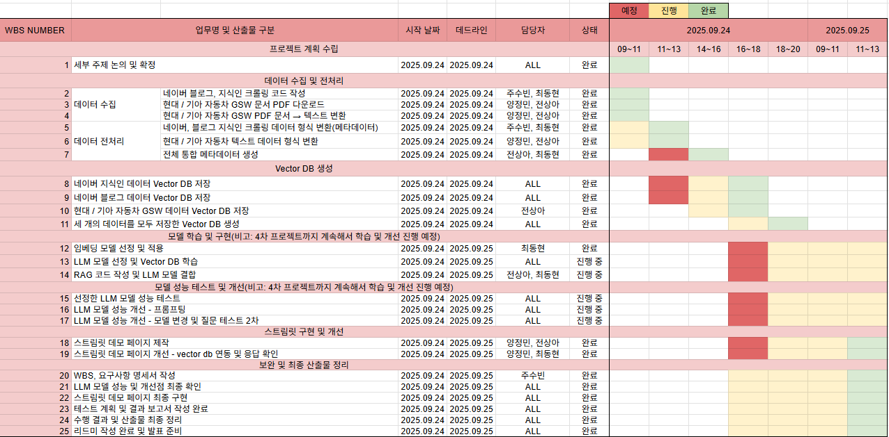
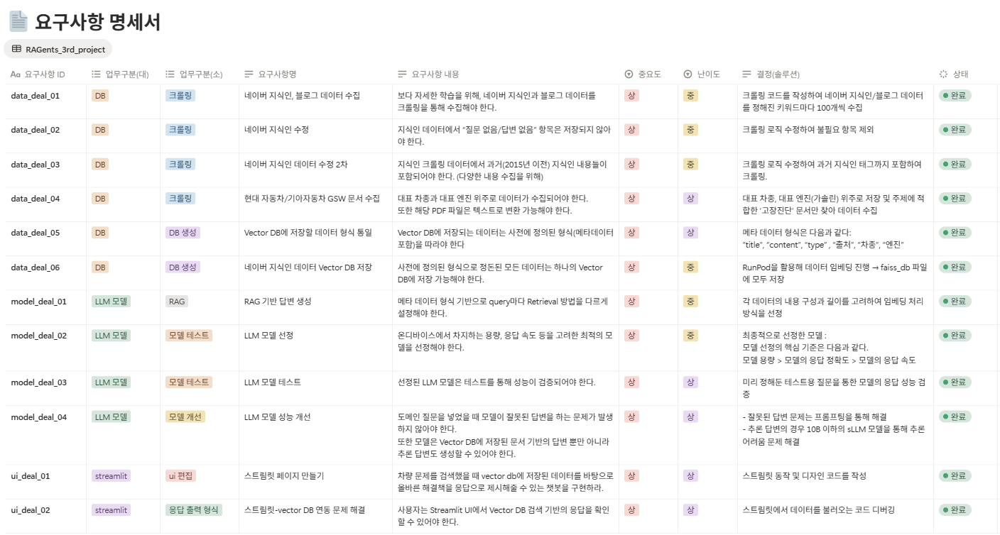
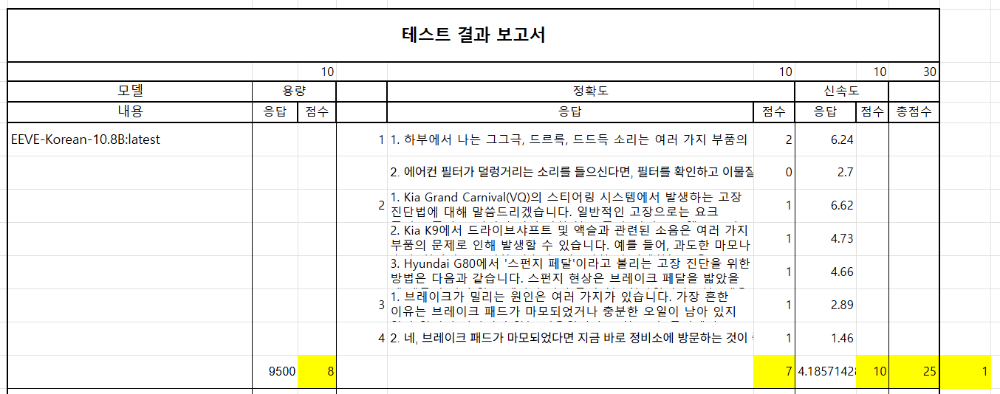
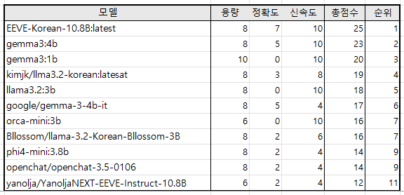
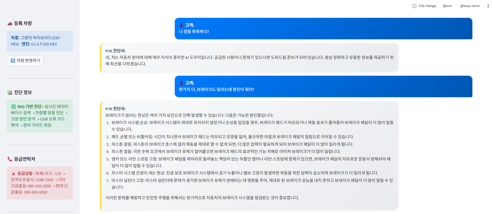
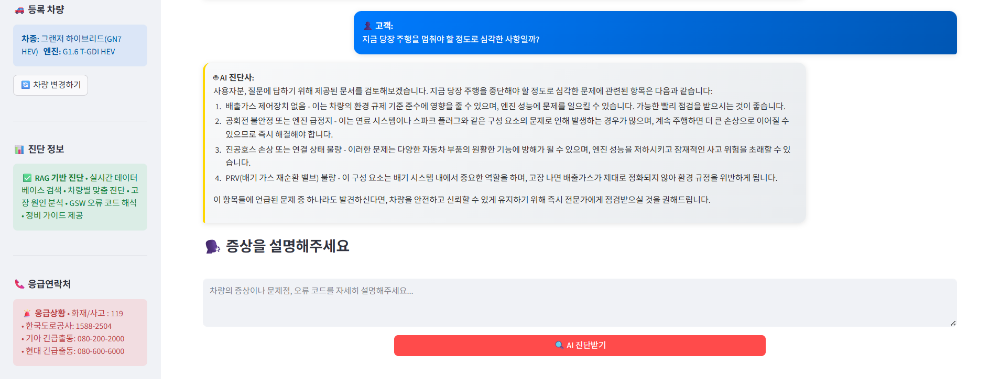

# SKN17-3rd-Team6
> SK네트웍스 Family AI캠프 17기 - 3차 프로젝트 6팀  
  개발 기간: 2025.09.24 ~ 2025.09.25

<br>

# 🔖 Contents
1. [팀 소개](#1-팀-소개)
2. [프로젝트 개요](#2-프로젝트-개요)
3. [기술 스택 & 사용한 모델](#3-기술-스택과-모델)
4. [시스템 아키텍쳐](#4-시스템-아키텍처)
5. [WBS](#5-WBS)
6. [요구사항 명세서](#6-요구사항-명세서)
7. [수집한 데이터 및 전처리 요약](#7-데이터-및-전처리)
8. [DB 연동 구현 코드](#8-Vector-DB-연동)
9. [모델 선정 과정](#9-모델-선정-과정)
10. [테스트 계획](#10-테스트-계획-및-결과)
11. [프로그램 성능 개선 노력](#11-성능-개선-과정)
12. [수행 결과(테스트/시연 페이지)](#12-시연-페이지)
13. [한계점](#13-한계점)
14. [향후 개선 계획](#14-향후-개선-계획)
15. [한 줄 회고](#15-한-줄-회고)

<br>
<br>

# 1. 팀 소개
#### 팀명: 💡 RAGents
> RAG + AGents의 합성어. RAG를 활용해 사용자에게 최적화된 챗봇을 만드는 능력자들.
#### 프로젝트명: 🚗🔧 자동차 고장 및 이상 증상 진단 챗봇 

### 팀 구성원
| 양정민 | 전상아 | 주수빈 | 최동현 |
|------------|------------|------------|------------|
| [@Yangmin](https://github.com/Yangmin3)| [@sang-a-le](https://github.com/sang-a-le) | [@Subin-Ju](https://github.com/Subin-Ju) | [@donghyun4957](https://github.com/donghyun4957) |


<br>
<br>


# 2. 프로젝트 개요
## 💡 프로젝트 소개
본 프로젝트는 현대/기아 **GSW 정비 매뉴얼**과 외부 데이터(네이버 블로그, 지식인)를 활용하여 차량 이상 증상(진동, 소음, 경고등 등)에 대한 진단 및 **정비 필요 여부**를 안내하는 **Retrieval-Augmented Generation(RAG) 기반 챗봇**입니다.

<br>

## ✅ 프로젝트 필요성

|  |  |
|---------------------------|---------------------------|
|[소비자민원평가-자동차; AS에 민원 집중](https://www.consumernews.co.kr/news/articleView.html?idxno=739584) | [반복되는 엔진경고등에도 원인 못찾고 방치... 뒤늦게 고장 판정되면 시간ㆍ비용은 소비자 몫](https://www.consumernews.co.kr/news/articleView.html?idxno=739584) |

2025년 7월 기준, 대한민국 자동차 등록 수는 2천640만 8천대로 집계되었습니다. 대한민국 전체 인구의 절반 가량이 차량을 보유하고 있으며, 그 중 현대와 기아 자동차는 국산차 전체 판매 점유율의 92%를 차지하는 만큼 그 규모가 매우 큽니다.  

현대 자동차와 기아 자동차는 최대 판매 규모에 걸맞은 우수한 민원 처리 체계를 갖추고 있으나, 그럼에도 차량에 고장이나 이상 증상이 발생하면 소비자들은 정확한 원인을 파악하기 위해 인터넷을 검색하거나 서비스 센터를 방문하는 등 시간과 노력을 들여야 합니다. 또한 원인을 어느 정도 파악하고 있다 하더라도, 당장 차량을 정비소에 맡겨 진단을 받아야 할 정도로 심각한 문제인지 일반 차량 운전자가 파악하기 어렵다는 문제가 있습니다.

저희의 챗봇은 이러한 문제를 겪고 있는 전국 약 2천 650만 명의 차량 보유자를 위해, 언제 어디서든 **쉽고 간편하게 고장 원인에 대해 일반 자동차 이용자도 파악할 수 있게 돕는** 챗봇을 만들게 되었습니다.  

위와 같은 문제를 해결하기 위해, 저희 팀은 다음과 같이 챗봇을 개발하였습니다.  

- **블로그/지식인 크롤링 내용**을 통해 보다 다양한 차량 고장 관련 키워드의 정보를 학습하고  
- **현대자동차/기아자동차 공식 GSW 문서**를 통해 높은 신뢰도를 갖는 정확한 고장 원인 진단 및 해결 방법에 대해 안내할 수 있도록 하며
- 사용자가 서비스 센터에서 고장 진단 및 처리를 받을 시 **정확한 이해**를 돕고자 했습니다.

<br>

## 🎯 프로젝트 목표
- 운전자: 정비소 방문 전 **이상 현상에 대한 원인 파악 가능**
- 정비 효율: **문제 사전 파악 → 불필요 방문 감소**
- 데이터적 측면: **기업 매뉴얼 + 사용자 경험 데이터 융합**
- 기술적 확장성: **추후 다른 브랜드 차량 GSW·포럼 데이터로 확장 가능**

<br>
<br>

# 3. 기술 스택과 모델
| **Language✍️** | **Tools🪛** | **Embedding😄** | **Vector DB📚** | **LLM🤖** |**Serving Platform**| **FrameWork🪟** | **Demo💡** | **Collaborate🔧** |
|-------------------|----------------|---------------|---------------|-------------|-----------------|----------------|---------------|--------------|
|  | <br>  | <sub><a href="https://huggingface.co/dragonkue/snowflake-arctic-embed-l-v2.0-ko">사용한 HF 모델</a></sub> |  |<sub><a href="https://huggingface.co/heegyu/EEVE-Korean-Instruct-10.8B-v1.0-GGUF">사용한 LLM 모델</a></sub> |  | <br> |  |  <br>  |


<br>
<br>

# 4. 시스템 아키텍처


<br>

# 5. WBS


<br>
<br>

# 6. 요구사항 명세서


<br>
<br>

# 7. 데이터 및 전처리

## 📂 데이터 출처 및 구조화

### 1. 현대/기아 GSW (정비 매뉴얼)

> PDF 정비지침서 → PDF파일 크롤링 → 텍스트 추출 → JSON 변환

- 단위: **고장진단 절차별 레코드**

- 메타데이터: ``차종``, ``엔진``, ``출처``

```json
"고장진단": [
  {
    "title": "보안 및 차량시동시스템+빌트인캠 영상 녹화 안 됨",
    "content": "퓨즈 단선/개조 확인, DVRS 고장 코드 점검, 모듈·카메라 점검",
    "type": "현대",
    "차종": "EV6(CV)",
    "엔진": "160KW+270KW(4WD)"
  }
]
```

### 2. 네이버 블로그
사용자 경험 데이터

AI로 요약한 본문 content 중심으로 **Chunk 단위 분할 및 임베딩**

```json
"문제 키워드": [
  {
    "title": "블로그 제목",
    "content": "블로그 내용",
    "type": "블로그",
    "출처": "https://blog.naver.com/example",
    "차종": null,
    "엔진": null
  }
]
```

### 3. 네이버 지식인
- Q&A 형식

- ``title(질문)`` + ``content(답변)``을 하나의 문서로 통합 후 임베딩

```json
"문제 키워드": [
  {
    "title": "질문",
    "content": ["답변1", "답변2"],
    "type": "지식인",
    "출처": "https://kin.naver.com/qna/example",
    "차종": null,
    "엔진": null
  }
]
```
<br>

## 🏭 데이터 전처리(1)
- 참고: [📁 text_preprocessing.py](./crawling/text_preprocessing.py)

### 1. 표 형태로 되어있는 PDF 내용 처리
#### 1-1. "현상", "고장"이 표 안에 있는 경우
- **현대 자동차**  
"현상", "코드", "원인", "고장 현상", "점검 항목" 등 필요한 데이터가 표 안에 담겨있을 경우,  
해당 내용들을 표 안에서 index를 찾아 반환하는 형식으로 추출.

- **기아 자동차**  
필요한 데이터인 "현상', "코드", "원인" 내용이 표 안에 담겨있을 경우,  
해당 내용들을 표 안에서 index를 찾아 반환하는 형식으로 추출.  

#### 1-2. "현상", "고장"이 표 밖에 <소제목> 형태로 있는 경우
1. `page.find_tables()` 메서드를 활용하여 표를 찾아서 추출  
2. `table.bbox[1]`를 통해 표 안에서 좌표를 찾아 내용을 반환.  

### 2. "현상", "원인" 데이터 추출 이후
- 문제 상황: 딕셔너리 형태로 .json 파일에 저장하는 과정에서 동일한 "현상" 또는 "원인"이 반복되는 문제   
#### 2-1. "현상"이 여러 번 반복
- 동일한 "현상"이 반복해서 담길 수 있도록 for 구문 활용
#### 2-2. "원인"이 여러 개 등장
- 하나의 "현상"에 존재하는 여러 "원인"들을 [리스트] 형태로 반환

### 3. 차종-엔진 형식 통일
- 표에 있는 모든 내용 추출이 완료된 이후, 위의 코드를 통해 차종-엔진 형식을 통일하여 카테고리 추출을 최종 완료함.

### 4. 지정 형식으로 변환
`데이터 출처 및 구조화` 항목에서 지정한 데이터 형식으로 변환하기 위한 처리 진행.  
`title`, `content`, `type`, `차종`, `엔진` 각 항목에 올바른 데이터가 들어갈 수 있도록 코드 작업.  

### 5. 메타 데이터 merge
- 1~4번 작업을 거친 현대 자동차와 기아 자동차 GSW 데이터에 관한 `json` 파일들을 merge하는 과정을 거쳐 새로운 파일로 통합.  
→ Vector DB에 저장될 수 있는 형식으로 최종 변환


### 6. GSW 및 네이버 블로그/지식인 크롤링 데이터 전처리
```
# 텍스트 정리 
def clean_string(s: str) -> str:
    if not s:
        return ""
    # 유니코드 정규화 (호환 문자 통합)
    s = unicodedata.normalize("NFKC", str(s))
    # 알파벳, 한글, 숫자, 공백만 남기기
    s = re.sub(r"[^0-9a-zA-Z가-힣\s]+", " ", s)
    s = re.sub(r"\s+", " ", s)   # 여러 공백 → 하나의 공백
    return s.strip()             # 앞뒤 공백 제거
```
> 특히 이모티콘, 공백, 엔터 스페이스가 많은 크롤링 데이터 위주로 위와 같이 전처리

<br>

## 데이터 전처리(2) - 🔍 검색 및 임베딩 전략

### 1. 임베딩 모델 선정
#### 선정 모델: dragonkue/snowflake-arctic-embed-l-v2.0-ko
retrieval 벤치마크에서 SOTA 성능을 기록했던 모델로 Korean retrieval tasks를 위해 학습된 모델

### 2. 임베딩 단위
| 데이터 출처 | 임베딩 단위 |
|------------|-----------|
| **블로그** | 본문을 Chunk 분할 후 임베딩 |
| **지식인** | 질문(title)과 Chunk 분할된 답변(content) 통합 → 단일 벡터 임베딩 |
| **GSW** | 고장진단 단위 → 레코드 단위 임베딩 |


**Chunk 과정**
```
splitter = RecursiveCharacterTextSplitter(
    chunk_size=1000,
    chunk_overlap=50
)

```
- 본문 내용이 긴 블로그 글과, 여러 개의 답변이 있는 지식인 내용의 경우 `chunk_size=1000` 으로 지정하여 임베딩을 진행함.


### 3. 검색 우선순위

1. **1차 검색** : GSW 내부 문서 (차종·엔진 기반)

2. **2차 검색** : 블로그/지식인 크롤링 (차종·엔진 없음 → 공통 키워드 기반)

3. **최종 답변** : 두 검색 결과 통합 + 신뢰도 가중치 적용

<br>
<br>

# 8. Vector DB 연동
### 사용한 벡터 DB: FAISS
**FAISS 선택 이유**
1. 고성능 유사성 검색: 벡터 데이터에서 가장 가까운 이웃 벡터를 효과적으로 찾아내는 Nearest Neighbor Search 기능을 제공하므로 빠른 검색 효율을 내기에 적합.
2. GPU 지원을 통한 가속 연산: GPU 연결 시 병렬 연산이 지원되어 처리 속도를 크게 향상시킬 수 있음.
3. 다양한 인덱스 유형: 여러 인덱스 유형을 지원하여 데이터 크기와 요구에 맞는 최적화된 검색 성능을 제공함.
4. 대규모 데이터 처리 성능: 다른 Vector DB에 비해 대규모 고차원 벡터 데이터를 빠르게 처리할 수 있는 능력이 뛰어남.   
→ 전통적인 방법으로는 효율적으로 처리하기 어려운 대규모 데이터 처리에 매우 적합. (약 8만 개 + 이후 계속 확장할 예정)
5. 커뮤니티 지원 및 확장성: 많은 엔지니어들이 지속적으로 개선하고 있으므로 확장성ㆍ안정성 면에서 우위를 점하는 DB.

**벡터 DB 코드 및 파일**
- [📁 vector_store.py](./database/vector_store.py)
- 🔗 [벡터 DB 구축(Google Drive)](https://drive.google.com/drive/folders/116zAgunFJb1ZxaShQKSVPMpM7oNylaXX?usp=sharing)

<br>
<br>

# 9. 모델 선정 과정
### 🤖선정 모델: `heegyu/EEVE-Korean-Instruct-10.8B-v1.0-GGUF`
  
**선정 과정**  

1. **모델 사용 목적** <br>
자동차에서 발생하는 다양한 문제의 원인을 파악하고 사용자에게 알려주는 챗봇

2. **주행 중 서비스 가능 여부** <br>
자동차 주행 중 발생하는 문제이다 보니 문제 발생 시 그 자리에서 효율적으로 처리하고 판단할 수 있는 여유를 제공해야하므로 주행중에 알려줄 수 있어야 함.

3. **주행 중 장소 상관 여부** <br>
주행하는 장소에 상관없이 동작해야 하므로 서버를 거치지 않는 로컬 모델이어야 함.

4. **모바일 vs 자동차** <br>
로컬에서 돌아가야 하므로 경량 모델이어야 하지만, 너무 작은 모델(1B~3B)의 경우 RAG 기반으로 복잡한 문서를 이해하고 사용자의 질문에 따라 답변을 추론할 수 있는 능력이 떨어지며 자동차에 탑재할 수 있는 사양은 핸드폰보다 메모리 및 발열 등에 대한 제약이 더 적기 때문에 자동차에 탑재 가능한 온디바이스 sLLM 모델로 선정

5. **메모리 용량** <br>
AI 연산 플랫폼에 탑재된다 하더라도 다양한 task를 위해 많은 모델들이 로드될 것이므로 적당한 메모리 용량의 제약 조건 내에서 동작하는 모델을 선정. 허용 범위를 16기가로 가정하고 그 안에서 동작하는 모델들을 후보군으로 선정 

6. **응답 속도** <br>
급발진과 같은 긴급사항에 대한 가이드라인을 제공해야하는 목적이라면 실시간성이 매우 중요. 
하지만 현대/기아 고장문서 기반 질의응답 챗봇이므로 급발진과 같은 긴급사항은 다루지 않으며 일반적인 문제에 초점이 맞춰져 있기 때문에 실시간성이 그렇게 중요하지 않다고 판단. 하지만 주행 중 판단하고 처리할 수 있는 여유를 제공해야 하므로 단거리, 짧은 시간 운전에도 답변을 받을 수 있어야 하기에 분단위의 너무 긴 응답시간을 가지면 안됨.


<br>
<br>

# 10. 테스트 계획 및 결과
## ✏️ 테스트 계획
| **정확도 항목** | **평가 항목** | **질문** | **의도** |
|---------------|------------------------|-----------------|--------------|
| **1** | 의성어, 의태어를 잘 인식하는지 | 1. 하부에서 그그극, 드르륵, 드드득 소리가 나.<br>2. 에어컨 필터가 덜렁거려. | 1. 해당 의성어를 '소음'으로 인식<br>2. 에어컨 필터가 떨어진 '현상'으로 인식 |
| **2** | 매뉴얼 내용을 잘 이해하고 요약해서 반환하는지 | - 길이 별 구분<br>1. kia 그랜드카니발(VQ)의 스티어링 시스템 일반사항 고장 진단법(572자)<br>2.kia K9(RJ)의 드라이브샤프트 및 액슬의 소음(197자)<br>3. Hyudai G80(RG3 EV)의 로어 페달 또는 스폰지 페달 고장진단(69자) | 상세한 차량 모델 및 증상을 반환했을 때 기존 매뉴얼 내용을 기본으로 요약된 내용 및 사용자 친화적 표현 방식으로 답변을 반환 |
| **3** | 꼬리질문에 대한 대응도 | 1. 브레이크가 밀리는 데 왜 그런거야? | 해당 질문 후 4) 항목에 대해 질문했을 때, 이전 질문 내용을 기억하고, 적절히 답변 |
| **4** | 사용자의 질문을 잘 이해하고 답변하는지 | 2. 브레이크 패드가 이상이 있는 것처럼 보여. 지금 바로 정비소에 가야 해? | 2. 정비소에 가야하는 지를 물어보는 질문에서 요점을 파악하고, 브레이크 패드에 대한 설명이 아닌 정비소 방문 여부에 대해 반환 |

<br>

## 📑 테스트 결과
### 평가 항목 및 배점
#### 평가 항목 전체 총합 만점: 30점
| **용량(단위: MB)** | **배점** |
|-----------------|---------|
| ~5000           | 10      |
| 5000~10000      | 8       |
| 10000~15000     | 6       |
| 15000~          | 4       |
> 용량 항목 만점: 10점

| **정확도** | **배점** |
|-----------------|----------------|
| 위의 의도에 맞는 내용을 반영시  | 1점 부여 |
| 위의 의도에 맞는 내용 미반영시  | 0점 부여 |
| 관련 내용에 대한 점검 내용이나 후속조치에 대한 내용 반환 시 | 1점 추가 부여 |
> 정확도 항목 총점 만점: 10점


| **신속도(단위: 초)** | **배점** |
|-----------------|---------|
| 1~5             | 10      |
| 5~10            | 8       |
| 10~15           | 6       |
| 15~             | 4       |
> 신속도 항목 만점: 10점

**테스트 상세 평가 항목**



### 최종 테스트 결과


<br>
<br>

# 11. 성능 개선 과정
## 1. 응답 품질 향상 시도
### 프롬프트 개선
- 문제 상황: 자동차 전문가 챗봇이지만, 도메인과 무관한 잡담 또는 일반 인사 질문을 넣었을 경우 문서를 기반으로 한 잘못된 응답 도출
- 개선 방법: 모델이 해당 질문에 대해 문서를 무시하고 질문에만 맞는 답변을 할 수 있도록 다시 프롬프팅.
```
instruction = """
당신은 자동차 전문가 챗봇입니다. 아래의 지침을 참고하여 최적의 답변을 생성하세요.
- 질문이 전문 지식 관련이면 제공된 문서를 참고하여 답변합니다.
- 잡담이나 일반 인사 질문이면 문서를 무시하고 질문만 답변합니다.
- 답변은 반드시 한국어로만 하며, 영어를 절대로 사용하지 마세요.
- 절대 대답에 프롬프트 내용이나 사용자 질문, 참고 문서 등의 내용을 포함시키지 마세요.
- 마크다운 표나 ###, ---, *** 같은 표시 없이 자연스러운 문단 형식으로 작성하세요.
- 운전자나 일반 독자가 이해하기 쉽게 설명하세요
"""
```

<br>
<br>

# 12. 시연 페이지




<br>
<br>

# 13. 한계점
- 경량 모델을 선정하고자 하였지만 약 10b 모델 선정
- 온디바이스 테스트 부족
- 블로그, 지식인 크롤링 과정에서 거르지 못한 무관한 글
- 기업 내부문서의 모든 차종 엔진유형에 대한 문서 추출 한계
- 8만 개의 데이터를 보유하고 있으나, 시간 상의 문제로 Vector DB에 4만 여 개의 데이터만 저장

<br>
<br>

# 14. 향후 개선 계획
### 파인튜닝 진행
- 진행 상황: 3차 프로젝트 진행 과정 중에 파인튜닝을 진행하지 않고 RAG까지만 진행하여 모델 학습 및 성능 테스트를 진행함.
- 진행 계획: sLLM 모델 파인튜닝을 통해 프롬프트 엔지니어링만으로 해결하기 어려웠던 문제들을 개선하고, 기존에 Vector DB에 저장한 내부 문서 및 크롤링 데이터를 활용해 '자동차 고장진단' 도메인에서 최적의 성능을 발휘하도록 조정할 것.

### 벡터 DB 개선
- 주제와 무관한 데이터 삭제: 블로그, 지식인 크롤링 과정에서 키워드 및 도메인과 무관한 내용의 글을 전부 거를 수 있도록 수정.
- 전처리 과정 고도화 작업 필요: 현대 자동차/기아 자동차 GSW 문서 임베딩 과정에서 "현상"과 "원인"을 단순 공백으로 연결 → 모델이 "현상"과 "원인"을 좀 더 잘 연결지어 이해할 수 있도록 임베딩 과정을 개선하여 벡터 DB를 발전시킬 예정.
- 데이터 추가 저장: 보유한 나머지 약 4만 개의 데이터를 벡터 DB에 추가로 저장하여 학습 및 성능 개선 과정에 활용할 계획.

### RAG 성능 향상: 리랭커
- 질문과 문서를 함께 분석하는 크로스-인코더(Cross-Encoder) 방식을 통해 질문과 Vector DB 문서 간의 상호작용을 직접적으로 분석하고, hallucination 현상을 대폭 감소시켜 같은 모델을 사용하더라도 더 높은 응답 정확성을 낼 수 있도록 수정할 계획.

### 경량 모델 추가 테스트
- 현재 사용중인 EEVE 모델의 10.8B 보다 경량화된 모델이 우수한 성능을 낼 수 있는지 추가 테스트를 진행할 예정
  - 만약 10.8B보다 경량화된 모델이 현재 모델만큼 성능이 우수하다면: CoT 를 진행
  - 만약 10.8B보다 경량화된 모델이 현재 모델보다 성능이 우수하지 않다면: CoT를 진행하기에 파라미터가 부족하다고 판단 → Conditional Chain을 생성하는 방식으로 변경하여 테스트하는 방법 고려

<br>
<br>

# 15. 한 줄 회고
- 양정민 : 
- 전상아 :
- 주수빈 : 
- 최동현 :
